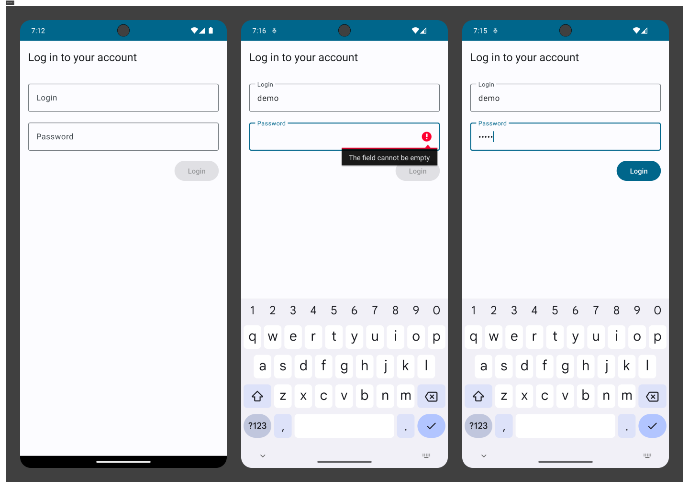
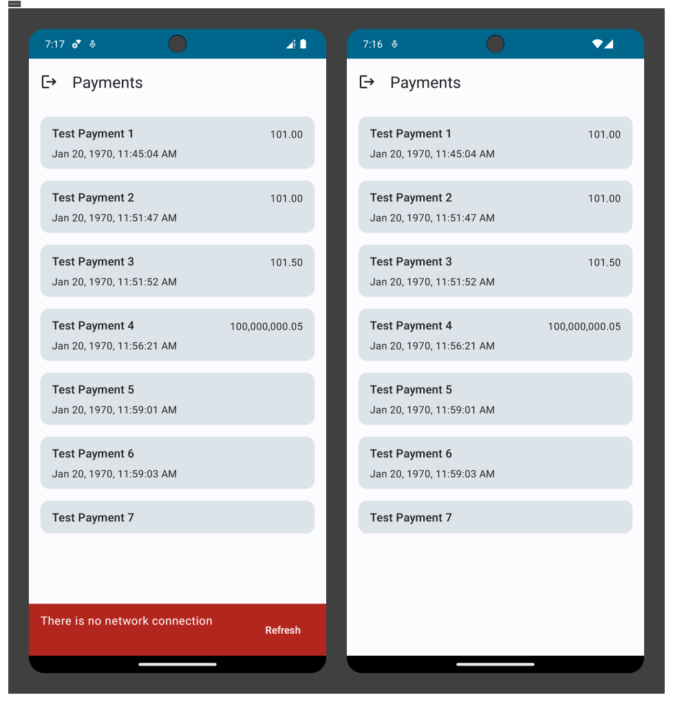

# Payments Test App

Программа-тестовое задание приложения с авторизацей и платежями.

## 1. Используемые технологии

1. Clean architecture (ViewModel / StateFlow)
2. Fragment / Navigation
3. Coroutines / Flow
4. Room
5. DataStore
6. Retrofit
7. Dagger2 / Hilt

## 2. Технические особенности

* Работа с сетевыми данными
* Кеширование данных
* Обработка входных данных, защита от ошибок
* Поддержка Android DynamicColors

## 3. Реализованные фичи

* [X]  Вход в аккаунт
* [X]  Выход из аккаунта
* [X]  Подгрузка и показ платежей пользователя
* [X]  Показ ошибки при отсутствии сети

## 4 Архитектура приложения

Архитектура приложения представляет из себя два основных слоя (Ui и Data). Архитектура придерживается концепции одноправленного потока данных.

[Ui](https://github.com/Kartex7260/PaymentsTest/tree/master/app/src/main/java/kanti/paymentstest/ui) состоит из двух подслоев: отображение (Activity / Fragment), держатель UI состояние (ViewModel)

[Data](https://github.com/Kartex7260/PaymentsTest/tree/master/app/src/main/java/kanti/paymentstest/data) состоит из дрёх подслоев: Repository <- DataSource (Local / Remote) <- Источник данных (Room / Retrofit)

Пакеты в data слое разделены на типы данных ([payments](https://github.com/Kartex7260/PaymentsTest/tree/master/app/src/main/java/kanti/paymentstest/data/model/payments), [authorization](https://github.com/Kartex7260/PaymentsTest/tree/master/app/src/main/java/kanti/paymentstest/data/model/authorization)), а не на сами подслои (repository, datasources, room, retrofit).

## 5. Экраны приложения

### Экран входа

Открывается если пользователь не вошёл в аккаунт.

Реализованна проверка данных в текстовых полях. Если поля будут пустые или иметь пустые символы (пробел), для пользователя кнопка будет неактивна.

При ошибке во время логина отобразиться ошибка об неправильных данных или отустсвия сети.

### Экран оплат

Открывается только если пользователь вошёл в аккаунт. Показывает все платежи пользователя.

В тулбаре есть кнопка для выхода из аккаунта. При ошибке сети показывает сообщение с воззможностью рефрешнуть.
